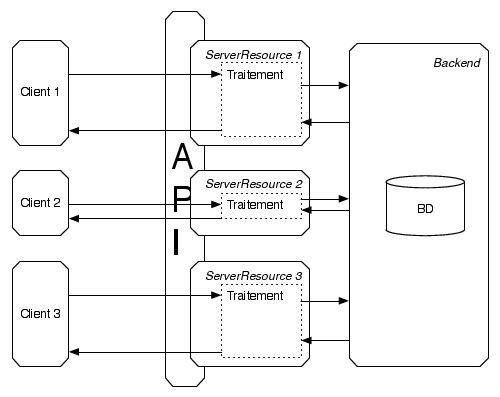

# My (simple) Twitter Application


Les sources sont disponibles sur  [Github](https://github.com/msimonin/RestletApplication/tree/TP).

Note : msimonin/RestletApplication branche TP

## Architecture


Dans ce TP nous utiliserons le framework RESTlet [[1]](http://restlet.com/) pour construire l'API REST d'un mini-twitter.

La figure présente une vision d'ensemble de l'architecture utilisée dans le TP.
 Chaque client effectuant des actions sur l'API voit sa requête (1) routée vers la bonne ressource (une instance d'une sous-classe de ServerResource) et (2) se voit attribuer un thread exécutant la méthode prévue (correspondant à GET, POST, DELETE ...).



## API

Le tableau regroupe les resources exposées par le système ainsi que les opérations associées.

URI | action  | description
---------|-------- | ----------------------------------
/users   | GET     | retourne la liste des utilisateurs
/users   | POST    | ajoute un utilisateur
/users/{id} | GET  | retourne  l'utilisateur avec d'id {id}
/users/{id} | DELETE  | supprime l'utilisateur
/users/{id}/tweets | GET | retourne les tweets de l'utilisateur
/users/{id}/tweets | POST | ajoute un tweet pour l'utilisateur

Pour simplifier l'API acceptera exclusivement que le JSON. C'est à dire qu'elle n'accepte que des messages au format JSON et ne répond qu'en JSON également.

## RAML

Le RAML[[2]](http://raml.org/) est un langage de description et de mise au point d'API REST.
Voici la description RAML de l'application qui détaille un peu plus le tableau donné précédemment.

```yaml
#%RAML 0.8
title: My Twitter Application
baseUri: http://localhost:8124

/users:
  displayName: utilisateurs
  get:
    description: retourne la liste des utilisateurs
    responses:
      200:
        body:
          application/json:
            example: |
              [{"id":0,"name":"john","user_url":"http://localhost:8124/users/0"},
              {"id":1,"name":"james","user_url":"http://localhost:8124/users/1"},
              {"id":2,"name":"jim","user_url":"http://localhost:8124/users/2"}]
  post:
    description: crée un nouvel utilisateur
    body:
      application/json:
        example: |
          {
            "name": "joe", "age":20,
          }
    responses:
      200:
        body:
            application/json:
              example: |
                {
                  "name": "joe", "age":20, "id":6
                }

  /{userId}:
    displayName: utilisateur
    get:
      description: Donne les infos de l'utilisateurs
      responses:
        200:
          body:
            application/json:
              example: |
                 {
                  "name": "joe", "age":20, "id":6, "tweets": 17
                  }
        404:
    delete:
      description: Supprime l'utilisateur
      responses:
        200:
        404:

    /tweets:
      displayName: tweets
      get:
        description: Donne la liste des tweets de l'utilisateur
        responses:
          200:
            body:
              application/json:
                example: |
                  [{"id":1,"message":"hello mta"},{"id":2,"message":"hello mta again"}]
      post:
        description: Ajoute un tweet
        body:
          application/json:
            example: |
              {
                "message": "this is my message"
              }
        responses:
          200:
          404:

/tweets:
  get:
    description: Donne la liste de tous les tweets.
    responses:
      200:
        body:
          application/json:
            example: |
              [{"id":1,
                "message":"hello 1",
                "user_name":"john"},
                "user_url": "http://localhost:8124/users/1",
                "tweet_url": "http://localhost:8124/users/1/tweets/1"
                {"id":2,
                "message":"hello 2",
                "user_name":"james",
                "user_url": "http://localhost:8124/users/2",
                "tweet_url": "http://localhost:8124/users/1/tweets/2"
               }]

```

## Implementation

### Squelette du projet

* Importer le projet dans ```eclipse``` et compiler le.
* ou utiliser la ligne de commande :
```
$) git clone https://github.com/msimonin/RestletApplication.git
$) cd RestletApplication
$) git checkout TP
$) mvn package
$) cd target
$) java -jar uber-mta.jar
```

### Tester l'implémentation courante

L'implémentation initiale expose GET et POST de la resource ```/users```.
Cette implémentation est volontairement fausse (c'est à vous de corriger !)
mais donne les élèments de base qui vous permettront d'implémenter l'API conformément à la description RAML donnée.

Vous pouvez tester votre implémentation à l'aide de l'outil ```curl``` disponible depuis la ligne de commande

exemple :
``` bash
# doit retourner la liste de tous les utilisateurs

# doit retourner les infos de l'utilisateur d'id 1

# doit ajouter un utilisateur

```


## References

* [1] RESTlet Framework http://restlet.com/

* [2] RAML http://raml.org/

## License

<a rel="license" href="http://creativecommons.org/licenses/by-sa/4.0/"></a><br />

Ce(tte) œuvre est mise à disposition selon les termes de la <a rel="license" href="http://creativecommons.org/licenses/by-sa/4.0/">Licence Creative Commons Attribution -  Partage dans les Mêmes Conditions 4.0 International</a>.
